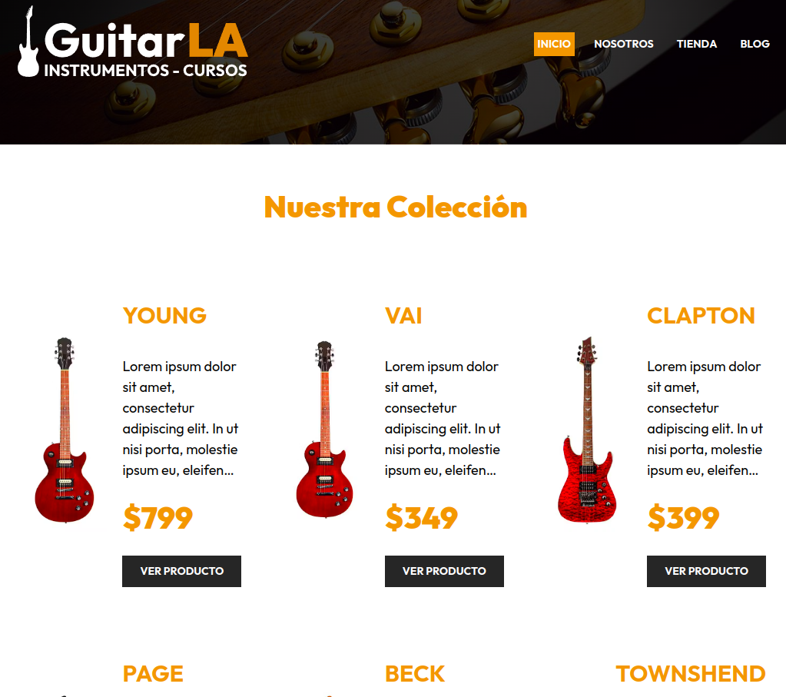

   
  <h2>Gestor de Gastos</h2>
  

    Aplicación sencilla sin Redux ni DDBB ni Backend: solo Frontend
  

  </img>

## 📜 Descripción

- Se utilizó **React** y **Next.js** el manejo del estado, las rutas estáticas y dinámicas, los enlaces, las imágenes y el Server Side Rendering
- El backend fue desarrollado en **Node** y **Strapi**
- **PostgreSQL** fue escogida para persistir los datos del backend
- Además, se implementó un plugin de **Cloudinary** para servir distintos formatos de imágenes 
- El proyecto se desplegado en [**Vercel**](https://frontend-next-p6.vercel.app/) . Sin embargo, el backend fue desplegado en el hosting gratuito de Render, por lo que la demo en línea puede tardar entre 1-2 minutos en servir las imágenes

## 🚀 Empezar

### **Versión Online**

Usa este [enlace](https://frontend-next-p6.vercel.app/ "Probar Demo") para probar el código desplegado en Vercel.
